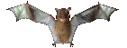

# link(arlo)s - Personal Website



## 🦇 Descripción

Este es el repositorio de mi página web personal...

## ✨ Características

- **Diseño Único**: Estética visual con elementos animados y efectos glitch
- **Cursor Personalizado**: Experiencia de navegación única con cursor animado
- **Modelo 3D**: Visualización de modelo 3D en la página principal
- **Elementos Animados**: Murciélagos voladores y elementos que rebotan en la pantalla
- **Página 404 Personalizada**: Página de error con estilo coherente con el resto del sitio
- **Responsive**: Adaptado para dispositivos móviles y de escritorio
- **Modo evil**: Activación automática a las 3 AM

## 🛠️ Tecnologías

- HTML5
- CSS3
- JavaScript
- Three.js (para renderizado 3D)

## 📁 Estructura del Proyecto

```
/
├── index.html          # Página principal
├── 404.html           # Página de error personalizada
├── css/
│   └── styles.css     # Estilos del sitio
├── js/
│   ├── scripts.js     # Scripts principales
│   └── lastfm.js      # Integración con Last.fm
├── images/            # Imágenes y GIFs utilizados
└── models/            # Modelos 3D (GLTF/GLB)
```

